# PEAG

Patient-context Enhanced Longitudinal Multimodal Alignment and Generation for
longitudinal multimodal clinical data with missing visits and modalities.

## Installation

```bash
pip install -e .
```

Requires Python 3.8+, PyTorch 1.9+, NumPy, and optionally `tqdm`.

## Quick Start

```python
import torch
from torch.utils.data import DataLoader

from peag.data.dataset import LongitudinalDataset, collate_visits, create_synthetic_data
from peag.model import PEAGModel
from peag.training.trainer import Trainer

device = "cuda:0" if torch.cuda.is_available() else "cpu"

modality_dims = {"modality_a": 61, "modality_b": 251}
model = PEAGModel(
    modality_dims=modality_dims,
    latent_dim=16,
    hidden_dim=32,
    temporal_model="recurrent",  # or "transformer"
).to(device)

patient_ids, visits_data, missing_masks = create_synthetic_data(
    n_patients=1000,
    n_visits=3,
    modality_dims=modality_dims,
    missing_rate=0.3,
)
dataset = LongitudinalDataset(
    patient_ids=patient_ids,
    visits_data=visits_data,
    missing_masks=missing_masks,
    train_mask_rate=0.6,
)
dataloader = DataLoader(dataset, batch_size=4, shuffle=True, collate_fn=collate_visits)

optimizer = torch.optim.Adam(model.parameters(), lr=1e-3)
trainer = Trainer(model, optimizer, device=device)
history = trainer.train(dataloader, n_epochs=50)
```

<p align="center">
  
</p>

## Paper Reproduction and Benchmarks

The repository includes dedicated folders for reproducing the paper's ablation
studies and benchmark experiments.

- `scripts/Ablation/`
  Contains PEAG ablation code for the two-visit metabolomics imputation task.
  This folder includes:

  - historical-state ablation at inference time
  - alignment-strategy ablations, including directional stop-gradient and point-wise alignment
  - loss ablations for removing `L_align` and `L_adv`
  - active-masking probability sensitivity analysis
- `scripts/Benchmark-single-cell-Method/`
  Contains the adapted static single-cell multimodal baselines used for the
  metabolomics imputation benchmark. This folder includes:

  - `MIDAS`
  - `scVAEIT`
  - `StabMap`
  - the shared patient-level split and CSV-to-benchmark preparation pipeline
- `scripts/Bencmark-EHR-Modeling/`
  Contains the paper's clinical patient-representation / EHR modeling
  benchmarks for the proteomics generation task. This folder includes:

  - a PEAG-based benchmark
  - a Transformer benchmark
  - a Llama 3.1 benchmark
  - shared utilities for loading history + current-lab inputs and reporting
    proteomics prediction metrics

## Recommended Data Format for Your Specific Task

- `visits_data`: `List[Dict[str, Tensor]]`, one dictionary per visit.
- `missing_masks`: `List[Dict[str, int]]`, one dictionary per visit.
- Mask convention:
  - `0`: currently available
  - `1`: actively masked during training
  - `2`: naturally missing

Example:

```python
visits_data = [
    {"modality_a": modality_a_t1, "modality_b": modality_b_t1},
    {"modality_a": modality_a_t2, "modality_b": None},
    {"modality_a": modality_a_t3, "modality_b": modality_b_t3},
]
missing_masks = [
    {"modality_a": 0, "modality_b": 0},
    {"modality_a": 0, "modality_b": 2},
    {"modality_a": 0, "modality_b": 0},
]
```

## Recommended Training and Inference for Your Specific Task

Train with active masking:

```bash
CUDA_VISIBLE_DEVICES=0 python scripts/train.py --device cuda:0 --n_patients 100 --n_visits 3 --epochs 10 --train_mask_rate 0.6 --modality_a_name modality_a --modality_a_dim 61 --modality_b_name modality_b --modality_b_dim 251 --save_dir ./ckpts
```

Train with transformer-based temporal modeling:

```bash
CUDA_VISIBLE_DEVICES=0 python scripts/train.py --device cuda:0 --temporal_model transformer --temporal_num_heads 4 --temporal_num_layers 1
```

Inference from a checkpoint:

```bash
CUDA_VISIBLE_DEVICES=0 python scripts/inference.py --device cuda:0 --checkpoint ./ckpts/checkpoint_epoch_10.pt
```

## Framework Summary

For visit `N`, PEAG:

1. Encodes only the currently available modalities.
2. Builds the historical state with a temporal autoregressive module.
3. Aligns available modality distributions with the historical latent state.
4. Computes the visit state with equal-weight fusion:

```text
Z^N = (Z_P + sum(Z_M)) / (M_total + 1)
```

Here `M_total` counts only the currently observed modalities and does not
include the historical state `Z_P`.

5. Decodes every modality from the fused visit state.

## Active Masking

During training, PEAG applies single-modality active masking:

- For each visit, one currently observed modality is randomly masked with
  probability `0.6`.
- Naturally missing modalities remain marked as `2`.
- If a visit has only one observed modality, it is not actively masked so the
  model always retains at least one current modality plus history.

This setting follows the paper revision: the model reconstructs the masked
modality from the remaining available modality information together with the
historical state.

## Temporal Module Options

The autoregressive component is not restricted to an RNN formulation.

- `temporal_model="recurrent"` uses a GRU-style hidden-state update.
- `temporal_model="transformer"` uses causal self-attention over previous visit
  states and is better suited to longer visit sequences.

Both options plug into the same PEAG fusion and decoding pipeline.

## API Summary

| Component                                                                                  | Description                                                |
| ------------------------------------------------------------------------------------------ | ---------------------------------------------------------- |
| `PEAGModel(..., temporal_model="recurrent")`                                             | Main model with recurrent or transformer temporal dynamics |
| `model.forward(visits_data, missing_masks, kl_annealing_weight=1.0, recon_targets=None)` | Returns `reconstructions` and `losses`                 |
| `model.impute_missing(visits_data, missing_masks)`                                       | Returns per-visit imputations                              |
| `LongitudinalDataset(..., train_mask_rate=0.6)`                                          | Dataset with single-modality active masking                |
| `Trainer(model, optimizer).train(...)`                                                   | Training loop with KL annealing and checkpointing          |

## License

MIT
